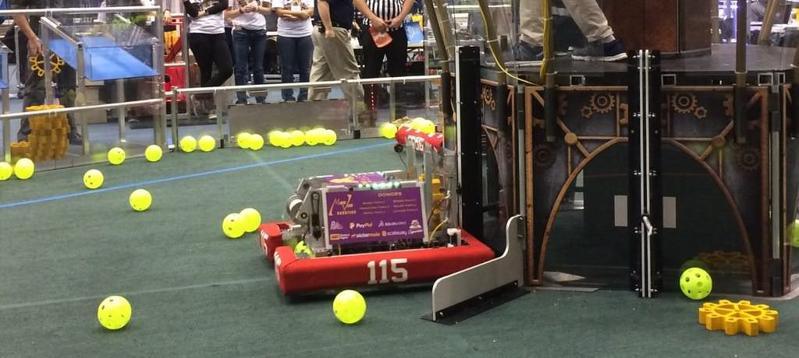
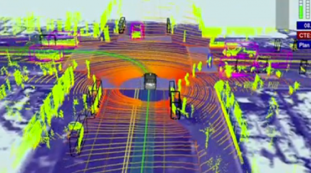
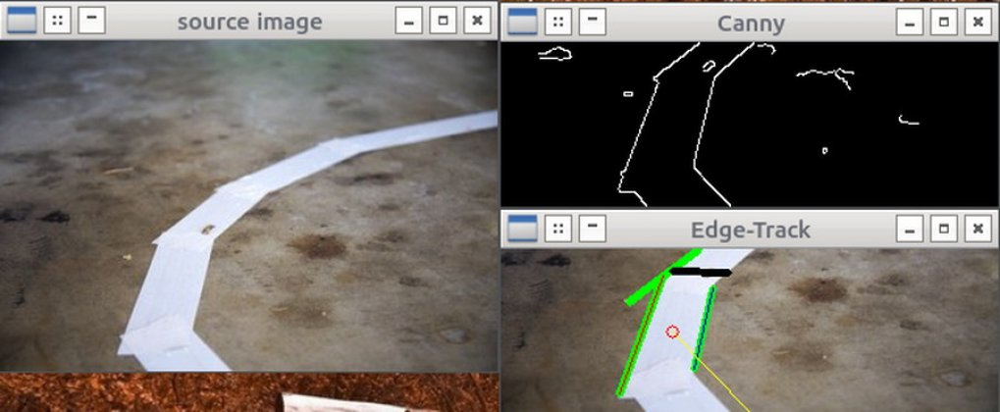
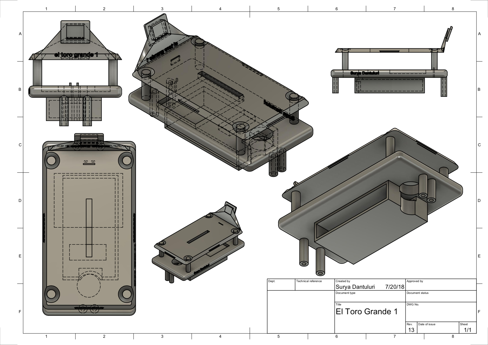
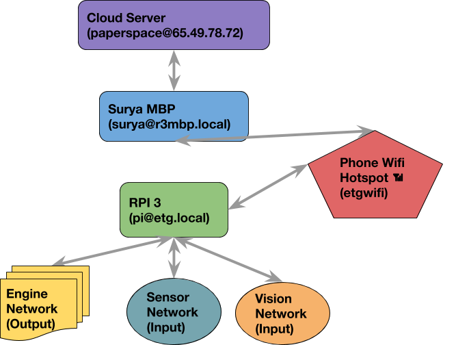
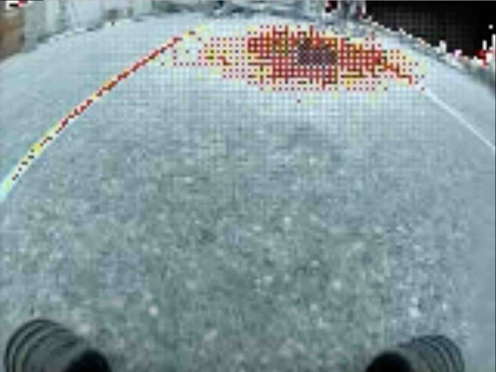

# International Autonomous Robot Racing Challenge 2018

###### Author: Surya Dantuluri | Affiliation: Monta Vista High School | Published: July 24, 2018 | Arxiv: https://arxiv.org/abs/1807.08233
---

# Introduction
---

None of this would have happened if ECX had made high-quality products.

Seriously.

It was the summer of 2013 where my mom, sisters and I went to visit a family friend in Fremont, CA. I just got a RC Car off Amazon with money I made at a small Closet Sale (my version of a garage sale, since I lived in an apartment complex). I decided to bring my brand-new RC Car to this family friend's house, since they had a road in front that led to a dead end (which meant practically no traffic). I  drove it around the street for a good 15 minutes before handing along to my sisters and the other family friends. They all played around with it for a while and it was fun to watch this small car drive around at speeds close to 15 mph. Then my mom called all of us to come in for a small lunch. While everyone else left, I decided to play around with my car for a couple more minutes before going in. After driving it down the street and back at around 10-15 mph, the car didn't come to a complete stop when I rotated the control knob to brake. Instead the car came to a slow stop, almost like it was on neutral mode, which I didn't think was possible. I was right. The motor was moving, but the car wasn't anymore.

I spent the next hour relentlessly debugging the issue. I tried resetting the receiver, resetting the controller, even trying slowly turning the throttle knob to see if it would move, even slightly. The servo worked for sure, but the car wasn't moving, even if the motor was running.

It took me weeks to finally get in contact with a Horizon Hobby representative to help me debug the issue. I found out 30 minutes later that something foreign to me at the time; the pinion gear was broken.

That's what started my 5-year career in building and modifying RC cars during the summer time.

## Robotics in High School
***

From ending a successful middle school career, I was pumped to continue my development at Monta Vista High School. I was President of the Science Olympiads club and the National Junior Honor Society at my middle school, two of the biggest organizations there. For various reasons, I moved near Monta Vista, one of the most reputable schools in Cupertino/Sunnyvale. I heard about how hard it was, but never did I think it was as hard as it was during Freshman and Sophomore year for me and many others. Anyway, as a pumped middle schooler, I joined the Robotics team and several other clubs right away, hoping for officer positions. Unfortunately, I didn't get any and surprisingly, not even during Sophomore or Junior year (I'll explain in another blog post). I also joined Cross Country because I was in Cross Country in 8th grade. Being on the Robotics team and in Cross Country wasn't the easiest, but it was manageable for me.

Over time, I realized that the team culture our robotics team had was really toxic. This matched news I've heard about lawsuits going against this team regarding its culture in previous years. As of writing this blog post, I can't and don't want to explain how bad it was for everyone on the robotics team, but it was bad enough that I had to leave.




Although a lot of friends I had made did still stick with the team, what ultimately make me decide to leave was that I thought **FIRST was more of a mechanical and hardware-based competition**. I wasn't really into the mechanical or hardware side of robotics since most of the time I didn't have access to those systems to learn more about them (I didn't have access to a CNC machine or 3D printer).  Surely software has a role, but many FIRST teams (that I know of) seem to really doubt their Computer Vision skills (or lack thereof) or newly, Machine Learning skills. It makes more sense considering FIRST is a competition geared toward high school kids, who generally don't have degrees or knowledge of complex/advanced CV or ML algorithms and how to implement them for fast-paced matches. Other than CV or ML, the only software I've seen (at Monta Vista's Robotics Team) that needs to be done is "fine tuning control". To this day I'm not really sure what Monta Vista's Robotics team was doing when "fine-tuning control" since remote controlled movement shouldn't be that hard to implement, especially when other teams open source their code on Github.

**I left the team in June of 2017.** This was after we won 1st at the Arizona North Regional competition and 2nd at the International competition. I decided that it was time to leave and go on to do other software heavy robotics projects.

A couple weeks after leaving, a nearby rival team, **Valkyrie Robotics, asked me to head Computer Vision at their team**. I accepted the role since most of the members were also Monta Vista students (there's a huge backstory on Valkyrie's existence and why it consists of only Monta Vista students). I spent a good amount of time there daily, but soon got caught in robotics drama. I left in July of 2017.


***Picture from: https://www.33rdsquare.com/2012/01/what-will-self-driving-cars-mean-for-us.html***


## Moving into Real Robotics
***

I don't really think FIRST robotics is real, professional grade robotics. From my 500 hours there, I've learned that FIRST robotics at MVRT and Valkyrie isn't anything more than plugging in some wires into an overpriced machine no more powerful than a $40 Raspberry Pi 3, called the roboRIO. There's definitely some hardcore CAD that goes into the design every year and some other fake outreach programs you are required to toot to other teams to show that you care about your community, but that wasn't enough to convince me to dedicate many hours of my day on a frequent basis to the

That's why I moved onto implementing autonomy onto the RC car I've been modifying since 2013.

### Playing with ROS
(I've recently learned that ROS is an acronym for a game as well. Just to be 100% clear, I am talking about the Robotics Operating System)

I started using ROS in August of 2017. Having some experience in C++ and Python, I started building ROS nodes to communicate with one another. One of the first things I did was interface two Turtlebots in a simulation to mirror one another's movements. Surely, I had to follow the tutorial step by step to get to this stage, but it showed me what ROS could really do.

#### Teaching ROS to FIRST Robotics Teams
After leaving the two FIRST teams I was in, I decided to teach ROS to FIRST teams in the Bay Area. Around 10 teams from around the Bay showed up (which I thought was pretty impressive). I taught them the basics and how they could implement them in their robotics. I even showed them a small demo using OpenCV, a Raspberry Pi 3, and a servo motor. Whenever a line on the whiteboard moved to the left or right, the servo would move that way as well. It was an example of publishers and subscribers with OpenCV integration.

#### Teaching ROS to Everyone
I made a video a while back detailing everything you need to know on how to get started with ROS. I didn't have time to edit and upload the hour-long video yet, but will soon.

# Getting Started with the International Autonomous Robot Racing Challenge (IARRC)
---

## How I found out about IARRC
***

Same way I found out about AVR: Georgia Tech's robotics team. I was interested in Georgia Tech so I decided to look around and see what their robotics team is doing (I've heard good reviews about the RoboJackets). I eventually found out about IARRC and was surprised to see it allowed high schoolers. What was even better was that it allowed solo competitors to join. This was crucial since I didn't personally know of many friends who were interested in robotics and had some Machine Learning/Computer Science knowledge.

## Initial Approach
***


**I spent 9 months working on ROS**

I had OpenCV integrated, a mix of basic and advanced algorithms to take care of different parts of the competition. I knew this was going to be pretty computationally expensive, but not so much that an RPI3 and Dragonboard 410c working in parallel would both be exhausted of memory and CPU power.


***Representation of what I had done. By: http://www.yisystems.com***

I couldn't afford a $600 Nvidia TX2 board (even with the educational discount) and had no other option than to **scrape the entire ROS codebase I had written tirelessly day and night**

## Machine Learning Approach
***

For some reason I learned some Linear Algebra in Pre-Calculus, so I extended my knowledge of Linear Algebra by taking a look at the Deep Learning Book by Ian Goodfellow and other various tutorials. I quickly grew interested in the field of Machine Learning because I thought Generative Adversarial Networks (GANs) were pretty cool back in 2017 and even **got invited to the Tensorflow Developer Summit back in March**.

Another reason I was interested in Machine Learning was the various ways I saw it being used to help others. It was being used to diagnose diseases in humans, animals, and plants as well as advanced science as shown in the Particle Tracking Challenge by CERN.

**So I started working on implementing Machine Learning in my RPI3 and Arduino stack.**

# Working on IARRC
---

## Team
***

Just myself. Just a high schooler going against top-tier University teams who may be fully funded by their Universities and may have sponsorships.

## Hardware / Mechanical
***

Remember when I said I left MVRT because I didn't like the mechanical/hardware part? I still don't 100% love it, but I learned how to at least like it to build my robot. Hardware for me took the longest time, since designing parts and figuring out what components I needed took time and research. Stuff like what boards were compatible with I2C protocol was foreign to me a couple months ago, but now I think I've gotten a good of a grasp of the various protocols I used (and made) so that I can use it  for brushed motor and servo motor control.

### Learning CAD in 3 Days
Sometimes at the end of June I realized that my noob Tinkercad skills weren't going to help. I made a couple of rough models in Tinkercad, but there were several limitations with what you can do on a CAD software that's purely online. After doing some research I found that Fusion360 was the best option to use. They had several tutorials for noobs who used Tinkercad in the past and wanted to get more functionality, like me. 

It took me a grueling 3 complete days and nights to learn Fusion360 from top to bottom.

I'm not a pro yet, but I've learned most of the functionality there is to Fusion360 (I'm not familiar with all the keyboard shortcuts though). I used my knowledge to create a cost-efficient CAD model for my car. I created multiple flat layers to cut down costs while maintaining functionality for the robot. 

After a couple more days of designing and building, I finally built a model that incorporated all the components I needed for the robot.

### 3D Printing in the Bay Area
3D printing in the Bay Area is hard. Really hard. At least for me. I called over 30 printing services in the Bay Area and found no price lower than $3,000 for my model. Even spaces like HackerDojo or other makerspaces weren't available or didn't answer my calls or emails.

With the death of TechShop, the only 3D printing service I knew of was the Sunnyvale Library. But with the dimensions of my model, there was no way I could get it to be printed. Even if my model was in the dimensions of their printer, the earliest date I found on the library's website to when they were available to print was in November. **That's over a 5-month early booking!**

So I went with literally my last option, 3D Hubs. They allowed people with 3D printers from all over the world to print your item at a low cost. The only reason I was hesitant to buy from 3D Hubs was because everytime I looked for a printer, I got prices between the range of $300-$500. Albeit this was 10 times as cheap as prices I got from shops from around the Bay, it was still out of my budget.

Long story short, I got a 3D printing service order from Missouri. They gave me a reasonable price under $100 which I thought was okay.



### Putting it together

I have a lot of experience in woodworking. I've moved to computer science since those times, but have a lot of experience in the field. I used my woodworking skills to build a structure that put all the CAD layers together. 

## Software Integration
***

Software Integration is the mean layer between Hardware/Mechanical and Software. It is also one of the biggest challenges I thought I had. I was right. 

There were times I went Youtube and saw really cool RC Cars driving around in circles or autonomously driving on its own. Every time, however, I got really puzzled on how they integrate their Python code into their car.

This was still the case when trying to implement the Machine Learning Python code (previously ROS/OpenCV) into the car.

I eventually taught myself I2C protocol and made my own protocol between the Arduino and RPI3 using the Pyserial library (I made my own protocol for faster and more reliable data transfer between the boards).

PWM control wasn't that hard after I had found the PCA9685. I used the Adafruit library to finally control the throttle and servo.



## Software
***

Anything I explain here will be nothing more than copy and paste from what I have written in my paper for IARRC this year. Here's a brief summary instead. I've also attached a link to my paper at the end of this section and the beginning of this blog post.

### Brief Summary

I used Tensorflow to build a DCNN for Traffic Light Detection. I trained it on around 5,000 images that I pulled off Google Images. I had a 100 image test set and a 1,000 image validation set.

I used Tensorflow to build a DCNN to predict Steering Wheel values. I trained it on around 50,000 images I collected during the pre-competition day they gave us. I had a 5,000 validation set and a 100 image test set.

I used Tensorflow (I solely used Tensorflow, although I made a model in Caffe that had several problems running on the RPI3) to build a RNN/LSTM model to predict Throttle values. I explain this in my paper, but essentially it prevents rapid changes or stutters between drive loops. In other words, it smoothly increases and decreases speed instead of rapidly accelerating and deaccelerating  at random instances. During testing, the DCNN model actually broke the camera model a couple of times (as well as the ESC for some reason).



***Salient Object Visualization. Video here: https://www.youtube.com/watch?v=lFjsN7KcKIE***


### I explain a lot further of what I did in my paper.
#### Grab a copy at the following locations:
| Publication | Link
| ------------- |:-------------:| 
| arXiv | https://arxiv.org/abs/1807.08233 | 
| Surya Dantuluri's Paper Archive | https://papers.suryad.com/18.pdf | 
| viXra <sup id="a1">[1](#f1)</sup> | http://vixra.org/abs/1807.0358      |  


# Conclusion and My Limitations
---
This year-long journey was a long, strenuous, emotional, and most of all fun adventure. I had many dreams as a middle schooler and this was one of the ones I overtime didn't think I could achieve.

## Outscoring Georgia Tech on my own
***

This is something I thought would be impossible.

I lived in an apartment. Which mean I didn't have a garage. Not even power tools.

**I never had a mentor or coach**

I didn't have enough money to buy those coaches every friend I know does for their research projects. 

So I created a 100% original and organic research paper out of my grit and passion for Computer Science and Robotics.

**I self-taught myself everything I explained in this blog post and paper.**


**Available at: https://sourcerer.io/dantuluri**


#### So to say that I outscored Georgia Tech on my own is a testament of my work and passion.

### Acknowledgements (time sequential)

```
1. Caleb Kirksey
   - He gave me some initial help and encouragement
2. kangalow from JetsonHacks
    - He gave me some advice on what ESC to choose
3. Mohamed Alzaki
    - He gave me some advice on how he implemented Ultrasonic Sensors into his robot
4. Tawn Kramer
    - He gave me advice on how to integrate Hardware with Software in his videos
 
```
<b id="f1">1</b> I recently found out that viXra wasn't the best of publications. Hopefully, any of my work will be removed from their site soon [↩](#a1)


